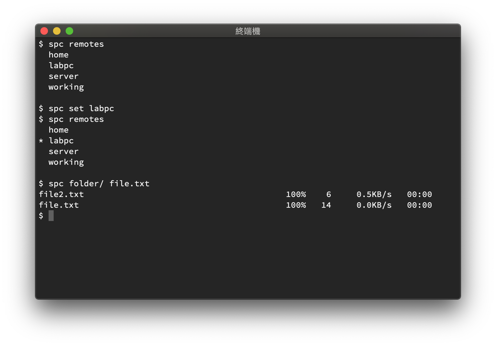

# SPC
SPC lets you transfer files and folders to multiple computers easily.



## Features
- Using a short name to identify each remote machine
- Transfer multiple files/folders simutaneously
- Intuitive operations 

## Installation
1. Clone this repo
```
    git clone git@github.com:dingyiyi0226/spc.git ~/.spc
```

2. Define `SPC_DIR` to the path where this repo is cloned. For Zsh or other shell user, subsitute `.bash_profile` for the corresponding configuration file.
```
    echo 'export SPC_DIR="$HOME/.spc"' >> ~/.bash_profile
    echo 'export PATH="$SPC_DIR/bin:$PATH' >> ~/.bash_profile
```

## How to use
### Set up remote machines
1. Create a remote machine
```
    spc create mypc myname@1.1.1.1
```

2. Set/Modify the configurations if needed ( [the supported configurations](#configurations) )
```
    spc update mypc -P=8787
```

3. Set the choosen machine as default
```
    spc default mypc
```

4. You can also get all avalible machines and the configurations on each machine
```
    spc remotes
    spc remote mypc
```

### Transmit files/folders to remote machines
After setting the machine `mypc` as default, we can transfer files easliy!

- Transfer to default machine
```
    spc file1.txt file2.txt dir1/
    spc download remoteFile1.txt remoteFile2.txt remoteDir1/
```

- Transfer to specific machine
```
    spc -r mypc file1.txt file2.txt dir1/
    spc download -r mypc remoteFile1.txt remoteFile2.txt remoteDir1/
```

## Configurations
For each remote machines, we can store these configurations:

- **address**. Must exists, autoset when you create the machine. Contains the informations of hostname and ip. (e.g. `myname@100.100.100.100`)
- **uploaddir**. The remote directory that stored uploaded files. The default directory is `~/`.  (Must set as absolute path)
- **downloaddir**. The local directory that stored downloaded files. The default directory is `~/`. (Must set as absolute path)
- **`scp` args**. 

## Commands

spc support these commands:

- [`spc`](#spc-upload) (same as `spc upload`)
- [`spc upload`](#spc-upload)
- [`spc download`](#spc-download)
- [`spc create`](#spc-create)
- [`spc delete`](#spc-delete)
- [`spc update`](#spc-update)
- [`spc remove`](#spc-remove)
- [`spc remote`](#spc-remote)
- [`spc remotes`](#spc-remotes)
- [`spc default`](#spc-default)

### File transmitting commands
#### `spc upload`
Upload file/folders to remote machine

    Usage: spc [upload|-u] [-r <remote-name>] <file> <file2> <...>

#### `spc download`
Download file/folders from remote machine

    Usage: spc {download|-d} [-r <remote-name>] <file1> <file2> <...>

### Remote setting commands

#### `spc create`
Create a new remote machine

    Usage: spc create <remote-name> <address>

#### `spc delete`
Delete a remote machine

    spc delete <remote-name>

#### `spc update`
Update the remote machine configurations

    spc update <remote-name> <config> <config2> <...>

#### `spc remove`
Remove the remote machine configurations

    spc remove <remote-name> <config-key> <config-key2> <...>

#### `spc remote`
Show the remote machine configurations

    spc remote [<remote-name>]

#### `spc remotes`
List all remote machines

    spc remotes

#### `spc default`
Set the default remote machine

    spc default <remote-name>


